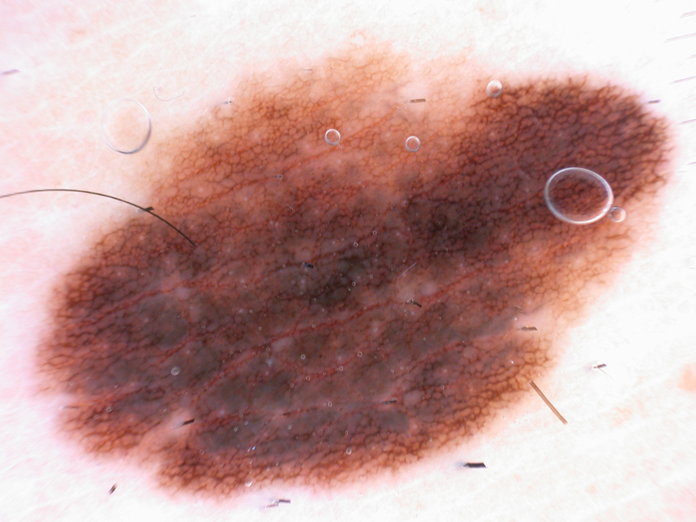
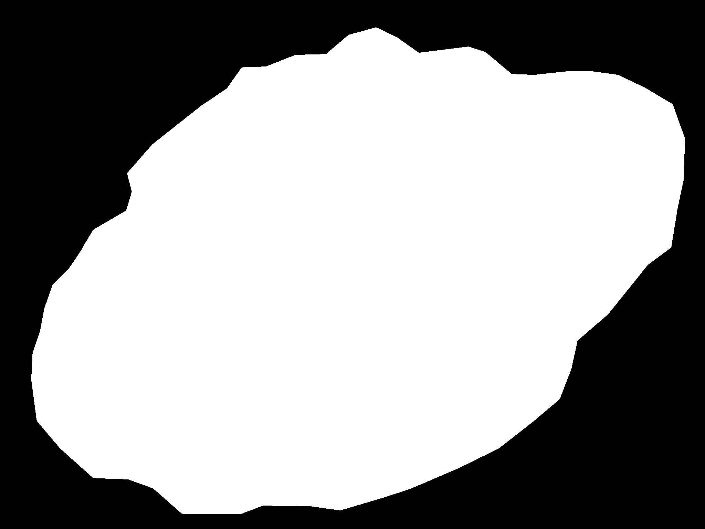
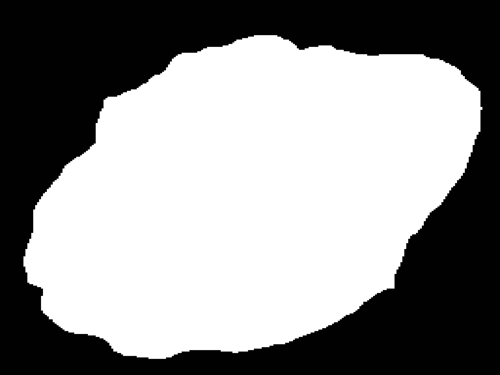

# U-Net for ISIC Skin Lesion Segmentation

A simple PyTorch implementation of **U-Net** for **binary skin lesion segmentation** on the **ISIC 2016** dataset.

## Visualization Results

**Model performance on the test set:** Dice = 0.8669, IoU = 0.7765

<table align="center">
  <tr>
    <td align="center"><b>Image</b></td>
    <td align="center"><b>Ground Truth</b></td>
    <td align="center"><b>Prediction</b></td>
    <td align="center"><b>Overlay</b></td>
  </tr>
  <tr>
    <td></td>
    <td></td>
    <td></td>
    <td></td>
  </tr>
</table>

<p align="center">
  <em>Qualitative example of skin lesion segmentation on the ISIC dataset.</em>
</p>

## Project Structure

```text
U-Net/
├── dataset/
│   ├── isic.py
│   └── isic/
│       ├── ISBI2016_ISIC_Part1_Training_Data/
│       ├── ISBI2016_ISIC_Part1_Training_GroundTruth/
│       ├── ISBI2016_ISIC_Part1_Test_Data/
│       └── ISBI2016_ISIC_Part1_Test_GroundTruth/
├── model/
│   └── UNet.py
├── loss.py
├── train.py
├── predict.py
└── README.md
```

## Features

- U-Net implementation in PyTorch
- Binary segmentation for skin lesion masks
- Dice loss and Dice loss with logits
- Training and evaluation with Dice and IoU metrics
- Save best and last checkpoints
- Save training history to CSV
- Plot loss, Dice, and IoU curves after training
- Inference script for single images or folders

## Dataset

This project uses the **ISIC 2016 / ISBI 2016 Skin Lesion Analysis** segmentation dataset.

Expected dataset folders:

```text
dataset/isic/
├── ISBI2016_ISIC_Part1_Training_Data/
├── ISBI2016_ISIC_Part1_Training_GroundTruth/
├── ISBI2016_ISIC_Part1_Test_Data/
└── ISBI2016_ISIC_Part1_Test_GroundTruth/
```

## Installation

Create and activate a virtual environment, then install the dependencies.

### Windows PowerShell

```bash
python -m venv .venv
.\.venv\Scripts\Activate.ps1
pip install -r requirements.txt
```

### Linux

```bash
python3 -m venv .venv
source .venv/bin/activate
pip install -r requirements.txt
```

<!-- If you do not have a `requirements.txt` yet, install the core packages manually:

```bash
pip install torch torchvision matplotlib tqdm opencv-python
``` -->

## Training

Run:

```bash
python train.py
```

During training, the script will:

- train on the training split
- validate on the validation split or chosen evaluation split
- save checkpoints in `checkpoints/`
- save training logs to CSV
- save learning curves as PNG files

Typical outputs:

```text
checkpoints/
├── best_model.pth
├── last_model.pth
├── training_history.csv
├── loss_curve.png
├── dice_curve.png
└── iou_curve.png
```

## Inference

Run:

```bash
python predict.py
```

The inference script loads the trained model from:

```text
checkpoints/best_model.pth
```

and saves predicted masks and overlay images.

## Model

The segmentation model is a standard **U-Net** with:

- encoder-decoder structure
- skip connections
- double convolution blocks
- optional batch normalization
- 1-channel output for binary segmentation

## Loss Functions

Implemented in `loss.py`:

- `DiceLoss`
- `DiceLossWithLogits`

`DiceLossWithLogits` is the main loss used for training binary segmentation with raw logits.

## Metrics

The training script reports:

- **Loss**
- **Dice score**
- **IoU**

## Notes

- Masks are treated as **binary masks**.
- For binary segmentation, the model output has shape `[B, 1, H, W]`.
- The final prediction is obtained by applying `sigmoid` and thresholding.
- Resize masks with **nearest interpolation** to preserve labels.

## Example Repository Description

> PyTorch U-Net for binary skin lesion segmentation on ISIC 2016.

## License

You can use the **MIT License** for this repository if you want a simple and permissive open-source license.

## Acknowledgment

This project is based on the U-Net architecture for medical image segmentation and uses the ISIC skin lesion analysis dataset for experimentation.
